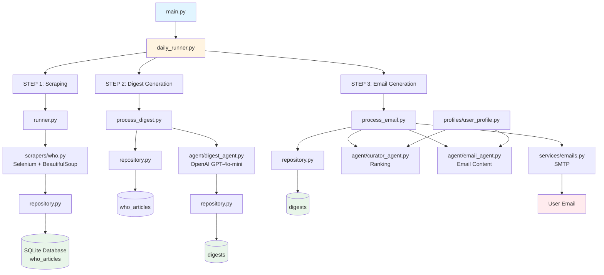

# News Aggregator Repository Architecture Map

## Overview
This is a health news aggregator that scrapes WHO news articles, creates AI-generated digests, and sends personalized email summaries.

## Quick Start

### Run Full Pipeline
```bash
python main.py [hours] [top_n]
# Example: python main.py 72 10
```

### Run Individual Steps
```bash
# 1. Scrape articles
python app/runner.py

# 2. Create digests  
python app/services/process_digest.py

# 3. Send email
python app/services/process_email.py
```

## Architecture Diagram (Mermaid)



## Architecture Diagram (Text)

```
┌─────────────────────────────────────────────────────────────────┐
│                         ENTRY POINTS                              │
├─────────────────────────────────────────────────────────────────┤
│                                                                   │
│  main.py                                                          │
│    └─> Calls app.daily_runner.run_daily_pipeline()               │
│                                                                   │
│  app/daily_runner.py (ORCHESTRATOR)                               │
│    └─> Coordinates the entire pipeline                           │
│                                                                   │
└─────────────────────────────────────────────────────────────────┘
                              │
                              ▼
┌─────────────────────────────────────────────────────────────────┐
│                    STEP 1: SCRAPING                              │
├─────────────────────────────────────────────────────────────────┤
│                                                                   │
│  app/daily_runner.py                                             │
│    └─> Calls app.runner.run_scrapers()                           │
│                                                                   │
│  app/runner.py                                                   │
│    ├─> Creates WHOScraper()                                      │
│    ├─> Creates Repository()                                      │
│    └─> Calls scraper.scrape_all(hours=24)                        │
│                                                                   │
│  app/scrapers/who.py (SCRAPER)                                   │
│    ├─> Uses Selenium + BeautifulSoup                             │
│    ├─> Scrapes https://www.who.int/news                          │
│    ├─> Extracts: title, url, date, type, full_text              │
│    └─> Returns List[WHOArticle]                                   │
│                                                                   │
│  app/runner.py (continued)                                       │
│    └─> Calls repo.bulk_create_who_articles()                    │
│                                                                   │
│  app/database/repository.py                                      │
│    └─> Saves articles to SQLite database                         │
│                                                                   │
└─────────────────────────────────────────────────────────────────┘
                              │
                              ▼
┌─────────────────────────────────────────────────────────────────┐
│                    STEP 2: DIGEST GENERATION                     │
├─────────────────────────────────────────────────────────────────┤
│                                                                   │
│  app/daily_runner.py                                             │
│    └─> Calls app.services.process_digest.process_digests()       │
│                                                                   │
│  app/services/process_digest.py                                   │
│    ├─> Creates DigestAgent()                                     │
│    ├─> Creates Repository()                                      │
│    └─> Calls repo.get_who_articles()                            │
│                                                                   │
│  app/database/repository.py                                      │
│    └─> Returns List[WHOArticle] from database                    │
│                                                                   │
│  app/services/process_digest.py (continued)                      │
│    └─> For each article:                                         │
│        ├─> Calls agent.generate_digest()                          │
│        └─> Calls repo.create_digest()                            │
│                                                                   │
│  app/agent/digest_agent.py (AI AGENT)                            │
│    ├─> Uses OpenAI API (GPT-4o-mini)                             │
│    ├─> Takes: title, content, article_type                       │
│    └─> Returns: DigestOutput(title, summary)                     │
│                                                                   │
│  app/database/repository.py                                      │
│    └─> Saves digests to database                                 │
│                                                                   │
└─────────────────────────────────────────────────────────────────┘
                              │
                              ▼
┌─────────────────────────────────────────────────────────────────┐
│                    STEP 3: EMAIL GENERATION & SENDING            │
├─────────────────────────────────────────────────────────────────┤
│                                                                   │
│  app/daily_runner.py                                             │
│    └─> Calls app.services.process_email.send_digest_email()     │
│                                                                   │
│  app/services/process_email.py                                   │
│    ├─> Calls generate_email_digest()                              │
│    │   ├─> Creates CuratorAgent(USER_PROFILE)                    │
│    │   ├─> Creates EmailAgent(USER_PROFILE)                       │
│    │   ├─> Calls repo.get_recent_digests()                       │
│    │   ├─> Calls curator.rank_digests()                          │
│    │   └─> Calls email_agent.create_email_digest_response()      │
│    │                                                              │
│    ├─> app/agent/curator_agent.py (AI AGENT)                     │
│    │   └─> Ranks digests by relevance to user profile             │
│    │                                                              │
│    ├─> app/agent/email_agent.py (AI AGENT)                       │
│    │   └─> Generates personalized email content                   │
│    │                                                              │
│    └─> Calls send_email() from app.services.emails               │
│                                                                   │
│  app/services/emails.py                                          │
│    ├─> Formats email (markdown + HTML)                           │
│    └─> Sends via SMTP (Gmail)                                    │
│                                                                   │
└─────────────────────────────────────────────────────────────────┘
```

## Component Details

### 1. Entry Points
- **`main.py`**: Main entry point, calls daily pipeline
- **`app/daily_runner.py`**: Orchestrates the entire pipeline (scraping → digest → email)

### 2. Scraping Layer
- **`app/scrapers/who.py`**: 
  - Uses Selenium to handle JavaScript-rendered content
  - Scrapes WHO news landing page
  - Extracts article metadata and full text
  - Returns `WHOArticle` objects

### 3. Database Layer
- **`app/database/connection.py`**: SQLite database connection (data/news.db)
- **`app/database/models.py`**: SQLAlchemy models (WHOArticle, Digest)
- **`app/database/repository.py`**: Database operations (CRUD)
- **`app/database/create_tables.py`**: Creates database tables

### 4. Processing Services
- **`app/services/process_who.py`**: Scrapes and saves WHO articles (alternative entry point)
- **`app/services/process_digest.py`**: Creates AI digests from articles
- **`app/services/process_email.py`**: Generates and sends email digests
- **`app/services/emails.py`**: Email formatting and sending utilities

### 5. AI Agents
- **`app/agent/digest_agent.py`**: Uses OpenAI to create article summaries
- **`app/agent/curator_agent.py`**: Ranks articles by user relevance
- **`app/agent/email_agent.py`**: Generates personalized email content

### 6. Configuration
- **`app/config.py`**: Configuration constants
- **`app/profiles/user_profile.py`**: User profile for personalization
- **`.env`**: Environment variables (API keys, email credentials)

## Data Flow

```
1. SCRAPING
   WHO Website → WHOScraper → WHOArticle objects → Database (who_articles table)

2. DIGEST GENERATION
   Database (who_articles) → DigestAgent (OpenAI) → Digest objects → Database (digests table)

3. EMAIL GENERATION
   Database (digests) → CuratorAgent (ranking) → EmailAgent (formatting) → Email Service → User's Inbox
```

## Execution Flow

### Full Pipeline (Recommended)
```bash
python main.py [hours] [top_n]
```
- Default: `hours=72`, `top_n=10`
- Runs: Scraping → Digest → Email

### Individual Steps
```bash
# Step 1: Scrape articles
python app/runner.py

# Step 2: Create digests
python app/services/process_digest.py

# Step 3: Send email
python app/services/process_email.py
```

## Database Schema

### `who_articles` table
- `article_id` (PK): Unique identifier
- `title`: Article title
- `url`: Article URL
- `release_date`: Publication date
- `article_type`: News type (e.g., "News release", "Statement")
- `full_text`: Complete article content
- `created_at`: Record creation timestamp

### `digests` table
- `id` (PK): `{article_type}:{article_id}`
- `article_type`: Type of article
- `article_id`: Reference to article
- `url`: Article URL
- `title`: Digest title
- `summary`: AI-generated summary
- `created_at`: Digest creation timestamp

## Dependencies

### Core
- `selenium`: Web scraping (JavaScript rendering)
- `beautifulsoup4`: HTML parsing
- `sqlalchemy`: Database ORM
- `requests`: HTTP requests

### AI/ML
- `openai`: OpenAI API client

### Utilities
- `pydantic`: Data validation
- `python-dotenv`: Environment variables
- `markdown`: Email formatting

## Environment Variables (.env)

Required:
- `OPENAI_API_KEY`: For AI agents
- `MY_EMAIL`: Gmail address for sending emails
- `APP_PASSWORD`: Gmail app password

## File Structure

```
news-aggregator/
├── main.py                    # Entry point
├── app/
│   ├── daily_runner.py        # Pipeline orchestrator
│   ├── runner.py              # Scraper runner
│   ├── config.py             # Configuration
│   ├── scrapers/
│   │   └── who.py            # WHO news scraper
│   ├── database/
│   │   ├── connection.py     # DB connection
│   │   ├── models.py         # SQLAlchemy models
│   │   ├── repository.py     # DB operations
│   │   └── create_tables.py  # Table creation
│   ├── services/
│   │   ├── process_who.py     # WHO processing
│   │   ├── process_digest.py # Digest creation
│   │   ├── process_email.py  # Email generation
│   │   └── emails.py         # Email utilities
│   ├── agent/
│   │   ├── digest_agent.py   # Summary generation
│   │   ├── curator_agent.py  # Article ranking
│   │   └── email_agent.py    # Email content
│   └── profiles/
│       └── user_profile.py   # User preferences
├── data/
│   └── news.db               # SQLite database
└── requirements.txt          # Dependencies
```

## Key Design Patterns

1. **Repository Pattern**: All database operations go through `Repository` class
2. **Agent Pattern**: AI operations encapsulated in agent classes
3. **Service Layer**: Business logic separated into service modules
4. **Pipeline Pattern**: Daily runner orchestrates sequential steps

